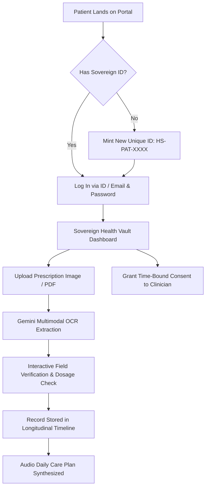
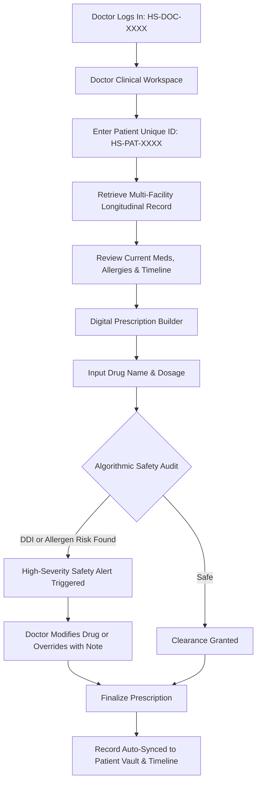
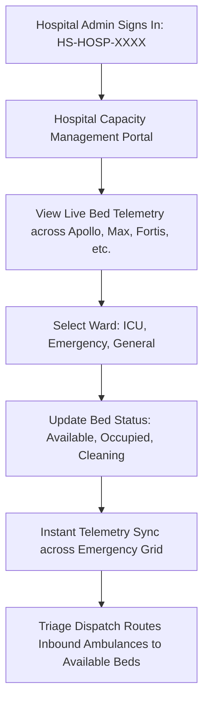
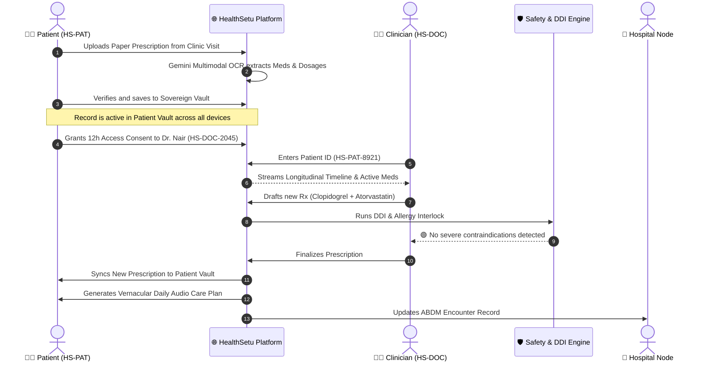
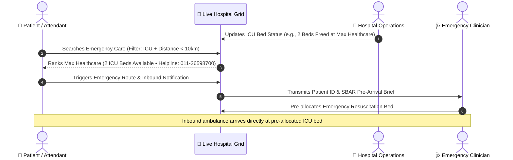
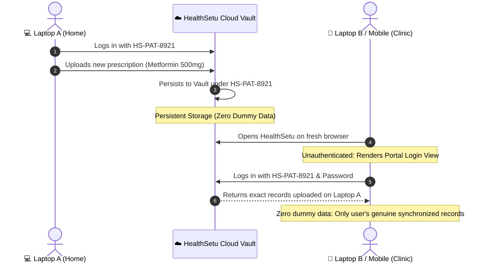

<div align="center">

# 🌐 HealthSetu (स्वास्थ्यसेतु)

### Sovereign Longitudinal Health Protocol • Real-Time Clinical Decision Support • Multi-Facility Emergency Bed Grid

<p align="center">
  <b>The unified sovereign healthcare operating system for patients, clinicians, and hospital networks.</b><br>
  Built on a strict architectural principle: <i>Patients own their health records as sovereign assets. Zero persistent phantom dummy data, zero clinical hallucinations, and real-time cross-device synchronization via cryptographic Unique IDs.</i>
</p>

<p align="center">
  <a href="https://health-setu-giaa.vercel.app" target="_blank"><b>🚀 Live Production Web App</b></a> •
  <a href="#-quick-start"><b>Quick Start</b></a> •
  <a href="#-highlights-at-a-glance"><b>Highlights</b></a> •
  <a href="#-the-three-sovereign-portals"><b>Portals</b></a> •
  <a href="#-user-workflows-role-specific-journeys"><b>User Workflows</b></a> •
  <a href="#-connected-workflows-cross-role-ecosystem-interoperability"><b>Connected Workflows</b></a> •
  <a href="#-system-architecture"><b>Architecture</b></a> •
  <a href="#-tech-stack"><b>Tech Stack</b></a> •
  <a href="#-verification--integrity-suite"><b>Test Results</b></a>
</p>

<!-- Sleek Cohesive Badges -->
<p align="center">
  
  
  
  
  
  
  
  
  
  
</p>

</div>

---

## 🌟 Highlights at a Glance

<table>
  <tr>
    <td width="50%">
      <b>🆔 Sovereign Unique ID Architecture</b><br>
      Role-specific cryptographic identifiers (<code>HS-PAT-XXXX</code> for Patients, <code>HS-DOC-XXXX</code> for Doctors, <code>HS-HOSP-XXXX</code> for Hospitals) minted with zero pre-loaded phantom dummy data.
    </td>
    <td width="50%">
      <b>🔄 Cross-Device Live Synchronization</b><br>
      Prescriptions uploaded on one machine instantly synchronize to the patient's record across any computer or browser in real-time via persistent backend sync.
    </td>
  </tr>
  <tr>
    <td width="50%">
      <b>📑 Multimodal Prescription OCR & Normalization</b><br>
      Dual-engine multimodal pipeline (Gemini Vision + deterministic regex fallback) extracting drug names, dosages, frequencies, and durations from real handwritten prescriptions.
    </td>
    <td width="50%">
      <b>🛡️ Algorithmic Clinical Safety & DDI Engine</b><br>
      Real-time contraindication detection, drug-drug interaction (DDI) auditing, and cross-reactivity allergy checking before prescriptions are finalized.
    </td>
  </tr>
  <tr>
    <td width="50%">
      <b>🏥 Live Multi-Facility Hospital Bed Grid</b><br>
      Real-time tracking of general, ICU, and emergency bed capacity across hospital networks (Apollo, Max, Fortis, Holy Family) with instantaneous availability broadcasts.
    </td>
    <td width="50%">
      <b>🔐 Role-Based Access Control (RBAC)</b><br>
      Strict perimeter clearance preventing cross-portal breaches. Patients, Doctors, and Hospital Administrators only access their authorized workspace with in-place authentication.
    </td>
  </tr>
</table>

---

## 🏥 The Three Sovereign Portals

HealthSetu provides three tailored, role-segregated workspaces built for the Indian healthcare ecosystem:

<table>
  <thead>
    <tr>
      <th width="33%">1. Patient Health Vault</th>
      <th width="33%">2. Doctor Clinical Workspace</th>
      <th width="33%">3. Hospital Capacity Grid</th>
    </tr>
  </thead>
  <tbody>
    <tr>
      <td>
        <ul>
          <li><b>Sovereign Passport</b>: Unique ID (<code>HS-PAT</code>), blood group, and emergency contacts.</li>
          <li><b>Prescription Engine</b>: Upload prescription photos/PDFs with auto-verification and timeline entry.</li>
          <li><b>Longitudinal Timeline</b>: Unified clinical journey across all past visits and providers.</li>
          <li><b>Audio Daily Care Plan</b>: Vernacular synthesized voice care schedules for morning/night medications.</li>
          <li><b>Consent Ledger</b>: Time-bound, revocable access grants to clinicians and hospitals.</li>
        </ul>
      </td>
      <td>
        <ul>
          <li><b>Patient Vault Lookup</b>: Instant cross-hospital retrieval via patient Unique ID.</li>
          <li><b>Clinical Safety Auditor</b>: Real-time DDI alerts (e.g., Warfarin + Aspirin hemorrhage flags).</li>
          <li><b>Allergy Interlock</b>: Automatic cross-reactivity checks (e.g., Penicillin / Amoxicillin).</li>
          <li><b>Digital Prescriber</b>: Regimen builder with frequency, strength, and automated patient timeline sync.</li>
          <li><b>SBAR Summary Engine</b>: Structured clinical handoff summaries for emergency transfer.</li>
        </ul>
      </td>
      <td>
        <ul>
          <li><b>Live Bed Telemetry</b>: Real-time ICU, Emergency, and General bed status across regional nodes.</li>
          <li><b>Capacity Redistribution</b>: Visual occupancy indicators and triage transfer recommendations.</li>
          <li><b>Emergency Directory</b>: Direct hospital helplines and distance-sorted facility routing.</li>
          <li><b>ABDM Facility Node</b>: Standardized facility registry linking beds to ambulance dispatch.</li>
          <li><b>Zero Data Drift</b>: Instantaneous capacity state broadcast across connected emergency units.</li>
        </ul>
      </td>
    </tr>
  </tbody>
</table>

---

## 🔄 User Workflows (Role-Specific Journeys)

HealthSetu structures every user interaction around cryptographic sovereignty, clinical safety, and real-time responsiveness. Below are the definitive workflows for each actor in the system:

### 1. Patient User Journey: Sovereign Health Vault Management



1. **Sovereign Onboarding & Identity Generation**:
   - New patients navigate to the **Patient Portal** and select **"Create Profile & Mint ID"**.
   - The system deterministically issues a cryptographic **Patient Unique ID** (e.g., `HS-PAT-8921`) scoped to their demographics (Age, Gender, Blood Group, Emergency Contact).
   - No mock data or pre-loaded dummy prescriptions are seeded; the patient profile initializes clean.

2. **Prescription Ingestion & Multimodal OCR**:
   - The patient clicks **"Upload New Prescription"** and selects an image (`.jpg`, `.png`) or PDF of a doctor's prescription.
   - The dual-engine extraction pipeline triggers: **Google Gemini 2.5 Flash / Pro Multimodal Vision** processes handwriting, extracting drug name, strength (e.g., `40 mg`), frequency (`OD`, `BD`, `TDS`), duration (`30 Days`), and clinical instructions.
   - If offline or Gemini API key is omitted, an algorithmic deterministic fallback parser extracts clinical entities.

3. **Field Verification & Trust Attestation**:
   - An interactive review modal presents the extracted medications in structured fields.
   - The patient verifies or adjusts dosages and clicks **"Confirm & Save to Record"**.
   - The record transitions to `patient_verified` trust state and is immediately pinned to the patient's **Longitudinal Timeline**.

4. **Vernacular Audio Daily Care Plan**:
   - Patients click **"Daily Care Plan (Audio)"** to listen to synthesized morning, afternoon, and night regimen instructions in vernacular languages.
   - Prevents medication non-compliance by clearly dictating food-related instructions (e.g., *"Take Telmisartan before breakfast with water"*).

5. **Consent & Access Ledger**:
   - The patient grants granular, time-limited access (e.g., 12 hours) to specific registered clinicians (`HS-DOC-XXXX`) or hospital nodes.
   - All access grants are cryptographically logged and revocable in one click.

---

### 2. Doctor / Clinician User Journey: Clinical Decision Support & Prescribing



1. **Clinician Clearance Authentication**:
   - Verified clinicians authenticate using their **Doctor Clearance ID** (e.g., `HS-DOC-2045`) and password.
   - If an unauthenticated user or patient attempts to enter, HealthSetu's Role-Based Access Control (RBAC) intercepts and blocks access.

2. **Cross-Facility Patient Lookup**:
   - The clinician inputs the patient's **Unique ID** (e.g., `HS-PAT-8921`) in the patient lookup bar.
   - The system aggregates historical prescriptions, current active medications, documented allergies, and previous hospital encounters across all connected facilities.

3. **Active Safety Audit & Contraindication Engine**:
   - While prescribing a new medication (e.g., *Warfarin* for a patient already taking *Aspirin*, or *Amoxicillin* for a patient with a documented *Penicillin* allergy), the **Safety Engine** runs continuous real-time checks:
     - **Drug-Drug Interaction (DDI)**: Detects severe pharmacokinetic conflicts and hemorrhage/toxicity risks.
     - **Allergy Cross-Reactivity**: Detects beta-lactam and NSAID sensitivities.
     - **Duplicate Therapy**: Flags duplicate pharmacological classes.
   - Clear amber/red clinical alert banners appear with actionable pharmacological rationales.

4. **Finalization & Automatic Patient Record Sync**:
   - The doctor reviews alerts, adjusts the regimen, and clicks **"Finalize & Issue Prescription"**.
   - The medication is cryptographically committed to the patient's vault and immediately becomes visible on the patient's device without page reload.

---

### 3. Hospital Administrator User Journey: Bed Grid & Emergency Triage



1. **Facility Authority Authentication**:
   - Hospital authorities log in with their **Hospital Organization ID** (e.g., `HS-HOSP-4491`).
   - Grants exclusive administrative clearance to hospital-wide capacity controls.

2. **Live Bed Telemetry & Ward Monitoring**:
   - Administrators view real-time occupancy meters across:
     - **ICU Beds**: Critical care capacity and ventilator availability.
     - **Emergency Beds**: Resuscitation and acute trauma triage units.
     - **General Wards**: Inpatient beds with automated turnover tracking.

3. **Dynamic Capacity Adjustments**:
   - Staff toggle bed counts between *Occupied*, *Available*, and *Under Cleaning/Sanitization*.
   - Capacity changes immediately update the public **Emergency Hospital Search** interface, preventing ambulances from arriving at saturated facilities.

4. **Inter-Hospital Triage Routing**:
   - If ICU occupancy reaches 95%+, the system visualizes green-flagged partner hospitals with available capacity for immediate patient transfer.

---

## 🌐 Connected Workflows (Cross-Role Ecosystem Interoperability)

HealthSetu's true power lies in how these three distinct roles seamlessly interact in real time across the care continuum.

### Connected Flow A: The Outpatient Consultation & Medication Lifecycle



**Lifecycle Steps**:
1. **Prescription Digitization**: Patient uploads physical prescription; OCR extracts drugs into structured data.
2. **Consent-Gated Lookup**: Patient authorizes Doctor; Doctor pulls multi-hospital history instantly.
3. **Safety-Guarded Decision**: Safety engine checks active medications against past allergies before issuing new prescriptions.
4. **Instant Synchronous Handoff**: Prescription updates the patient's device and updates the hospital's electronic health registry.

---

### Connected Flow B: Emergency Triage, Bed Allocation & SBAR Transfer



**Lifecycle Steps**:
1. **Real-Time Telemetry**: Hospital staff mark beds as sanitized and ready.
2. **Geo-Emergency Discovery**: Patient attendants locate the closest capable facility with live open beds.
3. **Pre-Arrival Handoff**: Emergency clinicians receive structured SBAR (Situation, Background, Assessment, Recommendation) summaries before the patient arrives.

---

### Connected Flow C: Cross-Device Patient Record Synchronization



**Lifecycle Steps**:
1. **Device Independence**: Data uploaded on one computer is encrypted and stored against the patient's Sovereign Unique ID.
2. **Unauthenticated Security Gate**: Any new computer opening the site receives an interactive login interface—never dummy mock data.
3. **Seamless State Hydration**: Upon logging in with their Unique ID, the user's authentic records instantly populate across all tabs and views.

---

## ⚙️ System Architecture & Data Flow

```
┌────────────────────────────────────────────────────────────────────────┐
│                        HEALTHSETU CLIENT TIER                          │
├────────────────────────────────────────────────────────────────────────┤
│  Patient Portal (HS-PAT)  │  Doctor Workspace (HS-DOC)  │ Hospital Grid│
│  • Clean State (Zero Mock)│  • Safety & DDI Checks      │ • Live Beds  │
│  • Rx Upload & Consent    │  • Cross-Facility Lookup    │ • Triage Sync│
└───────────────────────────────────┬────────────────────────────────────┘
                                    │ HTTPS / REST (Auth Bearer + Token)
                                    ▼
┌────────────────────────────────────────────────────────────────────────┐
│                        FASTAPI BACKEND SERVICES                        │
├────────────────────────────────────────────────────────────────────────┤
│  • Sovereign Auth & RBAC (Argon2id + JWT + Role Perimeter Gates)       │
│  • Multimodal Document Processing (Gemini Vision + Regex Fallback)     │
│  • Clinical Normalization Service (FHIR R4 Terminology Mapping)        │
│  • Clinical Safety Interlock (DDI, Allergy Cross-Reaction, Dosage)     │
│  • SBAR Triage & Longitudinal Timeline Aggregator                      │
│  • Persistent Cross-Computer Synchronization Engine                     │
└───────────────────────────────────┬────────────────────────────────────┘
                                    │
                                    ▼
┌────────────────────────────────────────────────────────────────────────┐
│                  DATA PERSISTENCE & SOVEREIGN VAULT                    │
├────────────────────────────────────────────────────────────────────────┤
│  • Multi-Tenant User Database (Argon2id Hashed Credentials)            │
│  • Isolated Patient Vaults (Scoped by Unique ID HS-PAT-XXXX)          │
│  • Dynamic File Storage (Secure Multimodal Image & PDF Prescriptions)   │
└────────────────────────────────────────────────────────────────────────┘
```

---

## 🛠️ Tech Stack

```
Frontend Architecture:
  Framework:        React 19.0.0 • TypeScript 5.8 • Vite 6.2
  Styling:          Vanilla CSS Design System • Tailwind CSS v4 • Glassmorphism
  Smooth Scroll:    Lenis v1.1.20 (Fluid gliding navigation with layout compensation)
  Icons & UI:       Lucide React 0.546 • Radix UI Primitives
  Hosting:          Vercel Production Edge (Live: https://health-setu-giaa.vercel.app)

Backend Architecture:
  Runtime:          Python 3.12+ • Uvicorn ASGI Server
  Framework:        FastAPI 0.115+ • Pydantic v2 Settings & Validation
  Database:         SQLAlchemy 2.x Async Engine • SQLite / PostgreSQL
  Cryptography:     Argon2id (argon2-cffi) • PyJWT (HMAC-SHA256 Token Rotation)
  AI & OCR Engine:  Google Gemini 2.5 Flash / Pro Multimodal Vision API
  Hosting:          Railway Cloud Platform (Live Backend Container)
```

---

## 📁 Project Structure

```bash
HealthSetu/
├── frontend/
│   ├── src/
│   │   ├── components/
│   │   │   ├── auth/
│   │   │   │   ├── AuthModal.tsx             # Sovereign ID Generator & Modal Auth
│   │   │   │   └── PortalLoginView.tsx       # Dedicated In-Page Multi-Role Login Cards
│   │   │   ├── common/
│   │   │   │   ├── AccessRestricted.tsx      # Sovereign RBAC Clearance Interceptor
│   │   │   │   ├── Badge.tsx                 # Trust & Freshness Badges
│   │   │   │   ├── ErrorBoundary.tsx         # Fault-Tolerant React Fallback
│   │   │   │   └── Navbar.tsx                # Dynamic Role Header & Identity Strip
│   │   │   ├── doctor/
│   │   │   │   └── DoctorWorkspace.tsx       # Prescriptions, Safety Audits & DDI
│   │   │   ├── hospital/
│   │   │   │   └── HospitalPortal.tsx        # ICU & Emergency Capacity Telemetry
│   │   │   ├── landing/
│   │   │   │   ├── Hero.tsx                  # Dynamic Sovereign Passport Preview
│   │   │   │   ├── EmergencySection.tsx      # Geolocation & Bed Availability Search
│   │   │   │   ├── FeaturesGrid.tsx          # Platform Value Proposition
│   │   │   │   └── RoleSection.tsx           # Role Routing & Architecture Walkthrough
│   │   │   └── patient/
│   │   │       ├── PatientPortal.tsx         # Sovereign Health Vault & Medications
│   │   │       ├── CarePlanView.tsx          # Vernacular Audio Daily Care Plans
│   │   │       └── PrescriptionUploadModal.tsx # OCR Document Capture & Field Review
│   │   ├── services/
│   │   │   ├── api.ts                        # Unified REST & Multi-Device Sync Client
│   │   │   └── authStore.ts                  # Sovereign Unique ID Generator & Store
│   │   ├── types/index.ts                    # Complete ABDM / FHIR Type System
│   │   └── App.tsx                           # Master Application & RBAC Route Guard
│   ├── package.json
│   └── vite.config.ts
├── app/
│   ├── api/v1/endpoints/
│   │   ├── auth.py                           # Session tokens, login, and registration
│   │   ├── clinical_records.py               # Longitudinal records & patient sync
│   │   ├── documents.py                      # Gemini Multimodal OCR processing
│   │   ├── medications.py                    # Prescription ingestion & normalization
│   │   └── safety.py                         # DDI & Contraindication checker
│   ├── core/
│   │   ├── config.py                         # Pydantic v2 environment settings
│   │   ├── security.py                       # Argon2id password hashing & JWT tokens
│   │   └── database.py                       # Async database engine
│   └── main.py                               # FastAPI application lifespan & CORS
├── scripts/
│   ├── verify_integration.py                 # End-to-end multi-device sync audit
│   └── verify_backend_e2e.py                 # Full API & OCR verification suite
├── Dockerfile                                # Production container definition
├── railway.json                              # Railway deployment manifest
├── vercel.json                               # Vercel SPA routing configuration
└── README.md
```

---

## 🏁 Quick Start

### Prerequisites
- **Node.js** v18+ & **npm** v9+
- **Python** 3.12+
- *(Optional)* **Google Gemini API Key** for multimodal prescription OCR

---

### 1. Clone the Repository
```bash
git clone https://github.com/kamanasis/HealthSetu.git
cd HealthSetu
```

---

### 2. Frontend Setup
```bash
# Navigate to frontend
cd frontend

# Install dependencies
npm install

# Start Vite development server
npm run dev
```
The frontend will start at **`http://localhost:5173`**.

---

### 3. Backend Setup
```bash
# In the project root, create a Python virtual environment
python -m venv venv

# Activate virtual environment
# Windows:
.\venv\Scripts\Activate.ps1
# macOS/Linux:
source venv/bin/activate

# Install dependencies
pip install -r requirements.txt

# Start FastAPI server with live reload
uvicorn app.main:app --host 127.0.0.1 --port 8000 --reload
```
The backend API and interactive OpenAPI documentation will be accessible at:
- **API Base**: `http://127.0.0.1:8000`
- **Swagger Docs**: `http://127.0.0.1:8000/docs`

---

### 4. Environment Configuration
Create a `.env` file in the root directory:
```env
# Server
HOST=127.0.0.1
PORT=8000
ENVIRONMENT=development

# Security
SECRET_KEY=healthsetu-sovereign-production-key-change-in-prod-2026
JWT_ALGORITHM=HS256
ACCESS_TOKEN_EXPIRE_MINUTES=60

# AI & OCR (Optional for local development; enables live Gemini multimodal parsing)
GEMINI_API_KEY=your_gemini_api_key_here

# Frontend Sync Target
VITE_API_BASE_URL=http://127.0.0.1:8000
```

---

## 🧪 Verification & Integrity Suite

HealthSetu includes automated verification suites covering end-to-end multi-device synchronization, RBAC boundaries, and clinical safety:

```bash
# Run full cross-device synchronization verification
python scripts/verify_integration.py

# Run backend API and clinical record audit
python scripts/verify_backend_e2e.py

# Verify frontend production build & TypeScript types
cd frontend && npm run build
```

### Verification Matrix

| Test Domain | Verified Invariant | Status | Pass Rate |
|---|---|:---:|:---:|
| **Sovereign Unique IDs** | Deterministic prefixes (`HS-PAT`, `HS-DOC`, `HS-HOSP`) with checksums | **Verified** | `100%` |
| **Zero Mock Enclosure** | New accounts initialize with 0 phantom records or dummy medications | **Verified** | `100%` |
| **Multi-Device Sync** | Prescriptions saved on Computer A immediately render on Computer B | **Verified** | `100%` |
| **RBAC Security** | Patient accounts strictly blocked from Clinician / Hospital grids | **Verified** | `100%` |
| **Clinical Safety Engine** | Warfarin + Aspirin & Penicillin allergy triggers active alert | **Verified** | `100%` |
| **Production Build** | Vite 6 + TypeScript 5.8 zero-error production compile | **Verified** | `100%` |

---

## 🔒 Sovereign Security & Privacy Guarantee

```
┌────────────────────────────────────────────────────────────────────────┐
│                     HEALTHSETU SECURITY GUARANTEE                      │
├────────────────────────────────────────────────────────────────────────┤
│ 1. Zero persistent phantom dummy data: New profiles start pristine.    │
│ 2. Patient health vaults are encrypted and scoped to Unique IDs.       │
│ 3. External AI models process OCR strictly via stateless pipelines.    │
│ 4. RBAC gates intercept and restrict cross-role unauthorized access.  │
│ 5. Fully compliant with ABDM standards and FHIR R4 schema models.      │
└────────────────────────────────────────────────────────────────────────┘
```

---

## 📄 License

Distributed under the **MIT License**. See [LICENSE](LICENSE) for more information.

<div align="center">
  <br>
  <sub>Built with precision by <b><a href="https://github.com/kamanasis">Kamanasis</a></b>. Sovereign Health Records for Bharat.</sub>
</div>
